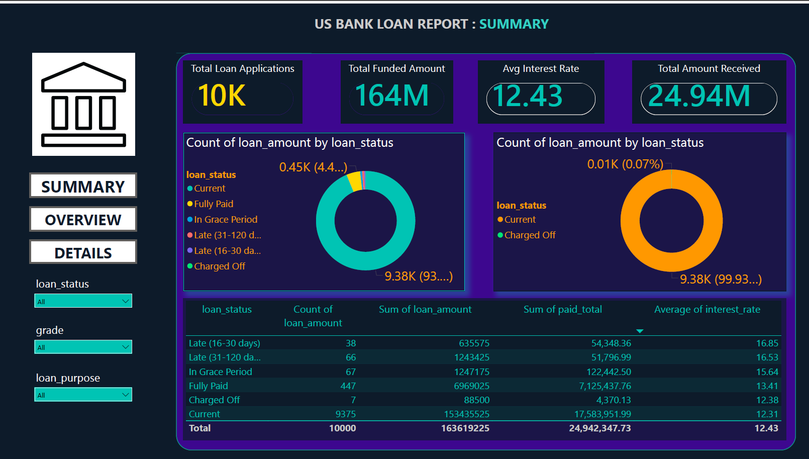
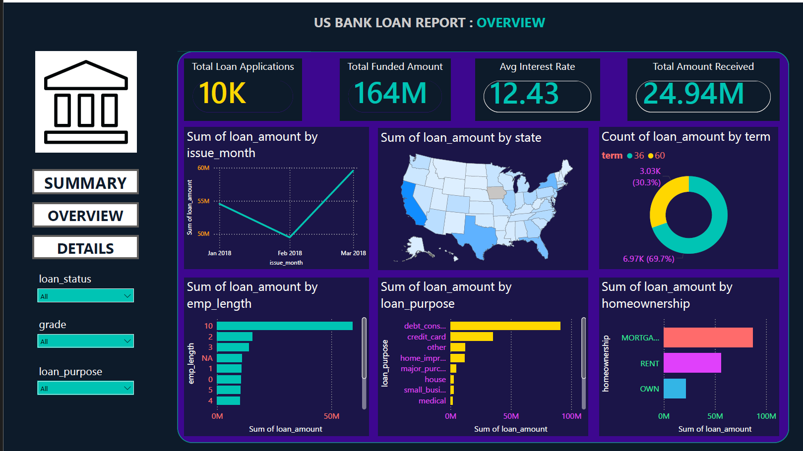
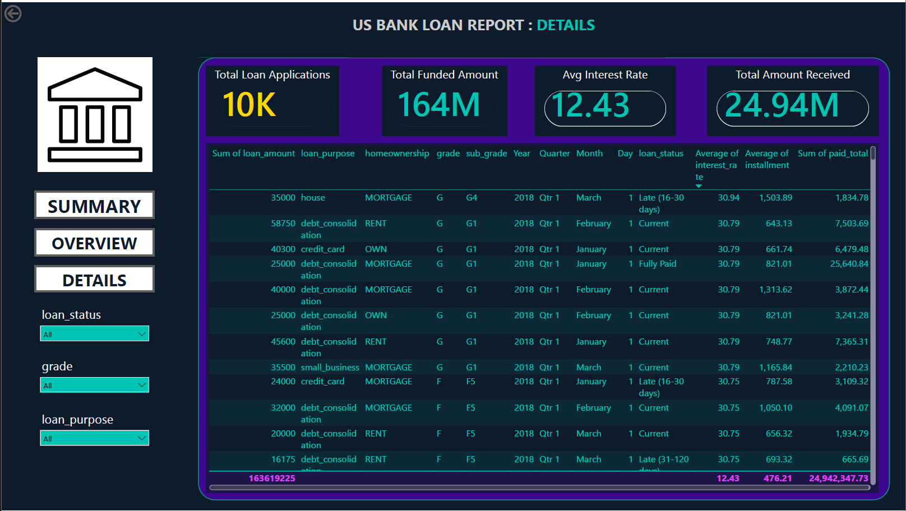

# US-BANK-LOAN-REPORT
# US Bank Loan Analytics Dashboard — Power BI

## Dashboard Preview

### Summary Page


### Overview Page


### Details Page


---

## Project Overview

This project presents a comprehensive 3-page interactive Power BI dashboard built to analyze and visualize loan data across the United States. The dashboard uses real lending data from LendingClub, one of America's largest peer-to-peer lending platforms, compiled and made publicly available by OpenIntro for research and educational purposes.

The goal of this project was to transform raw loan data into a clean, interactive, and professionally designed dashboard that tells the complete story of US bank loan performance — from high-level KPIs all the way down to individual loan records. The dashboard was built entirely from scratch, with every visual, color, and formatting decision made deliberately to maximize clarity and business impact.

This is not a template modification. Every page, every visual, every DAX measure, and every design choice was built independently to demonstrate real data analytics skills.

---

## Dataset

- **Source:** OpenIntro — LendingClub Loan Dataset
- **Website:** https://www.openintro.org/data/index.php?data=loans_full_schema
- **File:** loans_full_schema.csv
- **Total Records:** 10,000 loan applications
- **Total Columns:** 55 columns
- **Data Period:** 2018
- **Geography:** United States (all states)

### Key Columns Used

| Column | Description |
|--------|-------------|
| loan_amount | Total loan amount in USD |
| loan_status | Current status of the loan (Fully Paid, Current, Charged Off, etc.) |
| interest_rate | Annual interest rate on the loan |
| term | Loan term in months (36 or 60) |
| grade | Loan grade assigned by LendingClub (A to G) |
| sub_grade | Detailed sub-grade of the loan |
| loan_purpose | Purpose of the loan (debt consolidation, credit card, etc.) |
| homeownership | Borrower's home ownership status |
| emp_length | Borrower's employment length in years |
| issue_month | Month the loan was issued |
| state | US state of the borrower |
| annual_income | Annual income of the borrower |
| paid_total | Total amount paid by the borrower |
| installment | Monthly installment amount |

---

## Tools and Technologies

| Tool | Purpose |
|------|---------|
| Power BI Desktop | Dashboard creation and data visualization |
| Power Query Editor | Data cleaning and transformation |
| DAX (Data Analysis Expressions) | KPI calculations and measures |
| Microsoft Excel | Initial data review |
| Custom JSON Theme | Dark finance theme for professional look |

---

## Data Cleaning Steps

Before building any visuals, the raw CSV file was loaded into Power BI Desktop and extensively cleaned using Power Query Editor. The following steps were performed to ensure data quality and accuracy:

1. Loaded the raw CSV file containing 10,000 rows and 55 columns into Power Query Editor
2. Removed irrelevant and empty columns that were not needed for analysis, including joint income columns, collection amount columns, and other unused fields
3. Fixed incorrect data types — changed loan_amount to Whole Number, interest_rate to Decimal Number, installment to Decimal Number, annual_income to Whole Number, and paid_total to Decimal Number
4. Handled missing values in the debt_to_income column by replacing NA values with 0 and then removing the column entirely as it contained too many zero values to be useful for analysis
5. Removed error rows from numeric columns to prevent calculation errors in DAX measures
6. Standardized text columns including loan_status, homeownership, loan_purpose, and grade to ensure consistent filtering and grouping
7. Verified all data relationships and confirmed the dataset was clean and analysis-ready before closing and applying transformations

---

## Dashboard Pages

### Page 1 — Summary

The Summary page provides a high-level overview of the entire loan portfolio. It is designed to answer the most important question at a glance: how healthy is the loan book?

**KPI Cards:**
- Total Loan Applications — 10,000 loans
- Total Funded Amount — 164 Million USD
- Average Interest Rate — 12.43%
- Total Amount Received — 24.94 Million USD

**Good Loan vs Bad Loan Analysis:**
- Good Loans (Fully Paid + Current) represent 93.78% of all loans
- Bad Loans (Charged Off) represent only 0.07% of all loans
- Two donut charts visually separate good and bad loan performance

**Loan Status Table:**
A detailed breakdown table showing for each loan status:
- Total number of applications
- Total funded amount
- Total amount received
- Average interest rate

**Interactive Filters (Left Panel):**
- Loan Status slicer
- Grade slicer
- Loan Purpose slicer

---

### Page 2 — Overview

The Overview page provides a deeper analytical view of loan trends, geographic distribution, and borrower characteristics across all 6 visuals.

**Visual 1 — Monthly Trend Line Chart:**
Shows how total loan amounts changed month by month in 2018. Loan amounts increased steadily from January through March, indicating growing demand for credit.

**Visual 2 — USA State Map:**
A filled map showing the geographic distribution of loans across all 50 US states. Darker states indicate higher loan volumes, with larger states like California and Texas leading in total funded amounts.

**Visual 3 — Loan Term Donut Chart:**
Shows the split between 36-month and 60-month loan terms. 69.7% of borrowers chose the 36-month term, indicating a preference for shorter repayment periods.

**Visual 4 — Employee Length Bar Chart:**
Analyzes how employment length affects loan amounts. Borrowers with 10 or more years of employment received the highest total loan amounts, suggesting lenders favor stable, long-term employees.

**Visual 5 — Loan Purpose Bar Chart:**
Debt consolidation is by far the most common loan purpose, followed by credit card refinancing and home improvement. This tells us most borrowers are using loans to manage existing debt rather than fund new purchases.

**Visual 6 — Home Ownership Bar Chart:**
Mortgage holders take out more loans than renters or outright owners, likely because they have established credit histories and higher income levels.

---

### Page 3 — Details

The Details page provides a full row-level breakdown of every loan in the dataset, allowing stakeholders to drill into specific records and investigate individual loans.

**Columns shown in the detail table:**
- Loan Amount
- Loan Purpose
- Home Ownership
- Grade and Sub Grade
- Issue Year, Quarter, Month
- Loan Status
- Average Interest Rate
- Average Installment
- Total Amount Paid

The table is fully interactive and responds to all slicers on the left panel, allowing users to filter by loan status, grade, and purpose to find exactly the loans they want to investigate.

---

## Key Insights

**Insight 1 — The loan book is overwhelmingly healthy**
93.78% of all loans are either fully paid or currently active, with only 0.07% charged off. This suggests strong credit screening by LendingClub.

**Insight 2 — Debt consolidation dominates loan purposes**
The single largest use of personal loans in this dataset is debt consolidation, accounting for the majority of funded amounts. This reflects a broader trend of Americans using personal loans to manage credit card debt.

**Insight 3 — Experienced employees borrow more**
Borrowers with 10 or more years of employment take out significantly more loan amount than those with shorter employment histories, suggesting that employment stability is a key factor in loan approval and amount.

**Insight 4 — Short-term loans are preferred**
Nearly 70% of borrowers chose the 36-month term over the 60-month term, even though longer terms mean lower monthly payments. This suggests borrowers prefer to pay off debt quickly and minimize total interest paid.

**Insight 5 — Mortgage holders are the biggest borrowers**
Borrowers who own their homes with a mortgage take out more loans than renters or outright owners. This is likely because mortgage holders have stronger credit profiles and higher incomes.

**Insight 6 — Loan demand grew through early 2018**
The monthly trend shows increasing loan amounts from January through March 2018, with March showing the highest total funded amount. This could indicate seasonal patterns in borrowing behavior.

**Insight 7 — Higher risk grades carry higher interest rates**
Late payments are concentrated in grades F and G, which carry average interest rates above 30%, compared to grade A loans at around 7-8%. This confirms that interest rate is an effective proxy for credit risk.

---

## Dashboard Design

The dashboard uses a custom dark finance theme built specifically for this project. The design decisions were made to match professional financial reporting standards.

**Color Palette:**
- Background: Deep dark navy #0D1B2A
- Panel background: Dark blue #1E2A3A
- Primary numbers: Gold #FFD700
- Secondary numbers: Teal #00C4B4
- Borders and accents: Teal #00C4B4
- Text: White #FFFFFF
- Bad loan indicator: Orange/Red

**Design Features:**
- Left navigation panel with page buttons for easy navigation
- Bank institution icon at top of navigation panel
- Interactive slicers for filtering all visuals simultaneously
- Consistent card styling across all 3 pages
- Dark themed table with alternating rows for readability
- Custom visual titles and formatting throughout

---

## How to Use This Project

**Option 1 — View the dashboard:**
Download and open the `.pbix` file in Power BI Desktop to explore all 3 pages interactively.

**Option 2 — Clone the repository:**
```
git clone https://github.com/yourusername/us-bank-loan-dashboard
```

**Option 3 — Download the dataset:**
The raw dataset is available at: https://www.openintro.org/data/index.php?data=loans_full_schema

**Requirements:**
- Power BI Desktop (free download from Microsoft)
- No additional software or licenses required

---

## File Structure

```
us-bank-loan-dashboard/
│
├── US_bank_loan.pbix                  # Power BI Dashboard file
├── loans_full_schema.csv              # Raw LendingClub dataset
├── DarkFinance_Theme.json             # Custom Power BI dark theme
├── summary_screenshot.png             # Screenshot of Summary page
├── overview_screenshot.png            # Screenshot of Overview page
├── details_screenshot.png             # Screenshot of Details page
└── README.md                          # Project documentation
```

---

## DAX Measures Used

```dax
Total Loan Applications = COUNT(loans_full_schema[loan_amount])

Total Funded Amount = SUM(loans_full_schema[loan_amount])

Average Interest Rate = AVERAGE(loans_full_schema[interest_rate])

Total Amount Received = SUM(loans_full_schema[paid_total])

Good Loan Count = 
CALCULATE(
    COUNT(loans_full_schema[loan_status]),
    loans_full_schema[loan_status] IN {"Fully Paid", "Current"}
)

Bad Loan Count = 
CALCULATE(
    COUNT(loans_full_schema[loan_status]),
    loans_full_schema[loan_status] = "Charged Off"
)
```

---

## Future Improvements

- Add Month-over-Month (MoM) and Month-to-Date (MTD) calculations using DAX time intelligence functions
- Connect to a live data source for real-time loan monitoring
- Add a risk scoring visual based on grade and DTI ratio
- Include a borrower demographic analysis page
- Add drill-through functionality from state map to individual loan details
- Build a loan default prediction model using Python integration in Power BI

---

## Connect With Me

Feel free to connect with me on LinkedIn or reach out if you have any questions about this project.

---

## License

This project uses publicly available data from OpenIntro for educational and portfolio purposes.
